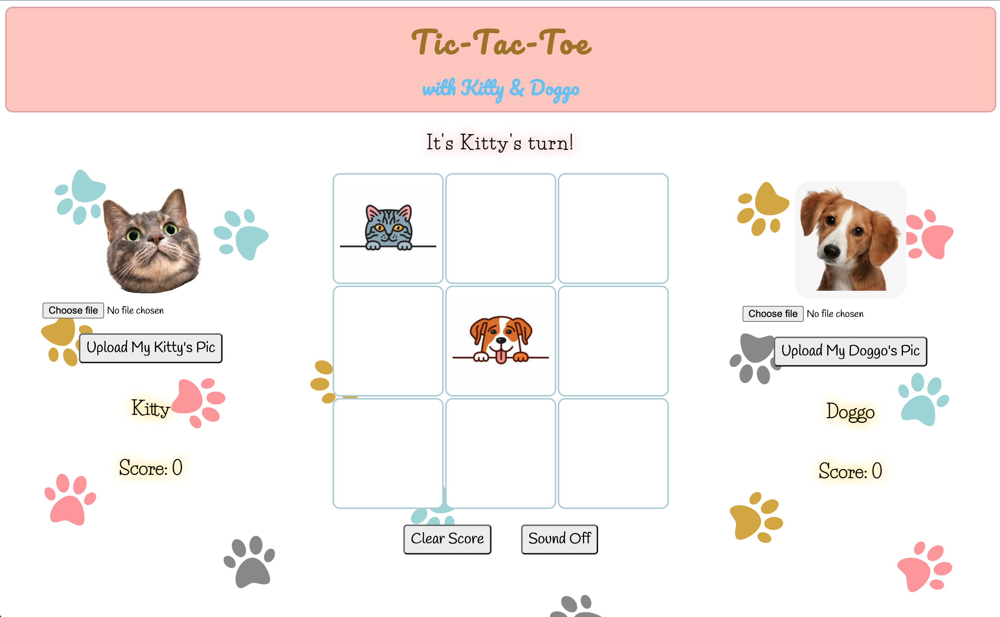
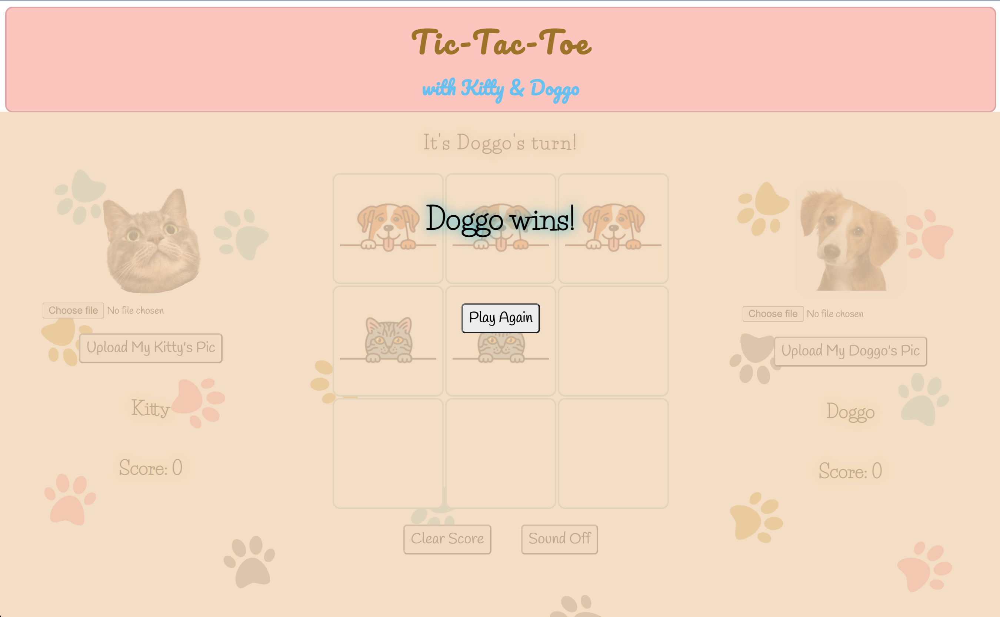
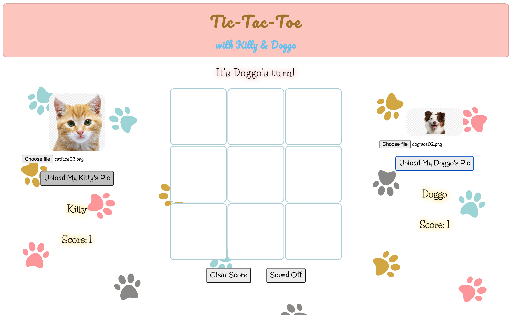
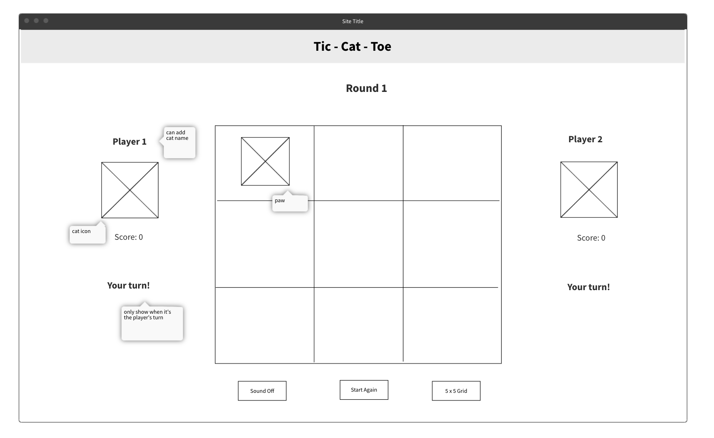
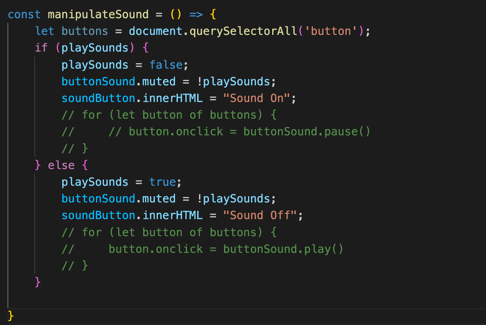

# Tic-Tac-Toe
Play with Kitty and Doggo!  
To enter the game，[click here](https://ymcodespace.github.io/Tic-Tac-Toe/).


## Snapshot  
  

  

  
 

## Tech used  
- HTML
- CSS
- Javascript
- DOM


## Features 
1. Upload your kitty/doggo’s picture to battle
2. Add score after each round
3. Clear both players’ scores whenever you want
4. Meow and woof sound effect when placing your sign
5. Button with click sound and shadow to show your move
6. Turn off the sound if it gets too annoying
7. Animated win message and cheering music  

 
## Planning and development  
Initial wireframing:  
  
Initially the two players are cats, the signs are paws. When implementing, the players and their signs are hard to visually differentiate on screen. Therefore the game changed to Kitty vs Doggo, adding visual and audio cues to differentiate players, signs and moves.

To add winning message, a result pop-up page is later implemented, with CSS animation.

Due to time restriction, the 5x5 grid play mode is not implemented. which can be updated in the coming weeks. Stay tuned!  
 

## Bugs and solutions  
### Altering signs

Bug: user can still click and change between two signs after one sign has been placed in the block.

```jsx
// BUG: when the block is clicked again, the sign will alter
const handleClick = (clickBlockEvent) => {
    let clickedBlock = clickBlockEvent.target;
    let clickedBlockIndex = clickedBlock.dataset['blockIndex'];
    if (currentPlayer === 'PlayerX') {
	    if (currentPlayer === 'PlayerX' && clickedBlock.innerHTML === '') {
	        clickedBlock.innerHTML = 'X';
	    } else if (currentPlayer === 'PlayerO' && clickedBlock.innerHTML === '') {
	        clickedBlock.innerHTML = 'O';
	    }
		}
```

Solution 1 (later not working): 

Add a boolean value “once” to remove the listener after it has been invoked once. When the `listener`would be automatically removed when invoked.

```jsx
for (let block of blocks) {
    block.addEventListener('click', handleClick, {once: true})
}
```

Why not work?

User cannot replay the game because the event listener has been removed. Event listener will need to be added again if {once: true} is used.

Solution 2:

Add two functions: placeSign and switchPlayer in the handleClick function to alter between two signs. To solve this bug, I need switchPlayer to be called at the right place in the flow.

First, I make sure placeSign function fill the clicked block with ‘X’, so its innerHTML can be used as an indicator for filled or not filled.

```jsx
const placeSign = (player, clickedBlock) => {
    if (player === 'PlayerX') {
        clickedBlock.innerHTML = 'X'
        clickedBlock.classList.add('playerX')
    } else if (player === 'PlayerO') {
        clickedBlock.innerHTML = 'O'
        clickedBlock.classList.add('playerO')
    }
}
```

Second, go back to the handleClick function and add a conditional when implementing placeSign. If there is no winner after each placing sign move, then switch player.

```jsx
// check if the block is filled
    if (clickedBlock.innerHTML === '') {
        // if empty, can place sign 
        placeSign(currentPlayer, clickedBlock)                                          
        // check if there is a winner/a tie
        if (checkWin(clickedBlockIndex)) {
            showResult()
        } else {
            switchPlayer()
        }
    }
```

switchPlayer function is like:

```jsx
const switchPlayer = () => {
    if (currentPlayer === 'PlayerX') {
        currentPlayer = 'PlayerO'
    } else {
        currentPlayer = 'PlayerX'
    }
```

To add in visual cue, CSS for blocks and player signs have different cursor: pointer and not-allowed.

```css
.block {
    background-color: white;
    color: transparent;
    display: table-cell;
    text-align: center;
    vertical-align: middle;
    width: 150px;
    height: 150px;
    border: 2px solid #b4d3db;
    border-radius: 10px;
    margin: 1px;
    cursor: pointer;
}
```

```css
.playerO {
    background-image: url(./images/img-dog.jpeg);
    background-size: 130px;
    background-repeat: no-repeat;
    background-position: center;
    cursor: not-allowed;
}

.playerX {
    background-image: url(./images/img-cat.jpeg);
    background-size: 130px;
    background-repeat: no-repeat;
    background-position: center;
    cursor: not-allowed;
}
```

### Muting button sounds

Bug: while the other sounds are controlled with an if-else condition, the button click sound is written in HTML with onclick attribute.

```html
<button class="game-end" onclick="buttonSound.play()">Clear Score</button>
<button class="audio-control" onclick="buttonSound.play()">Sound Off</button>
```

I initially try using a for loop to try pause and play the sound through the onclick attribute (see the comment-outs), this did not work well. With Yixuan’s help, we found .muted (boolean) to mute button sound instead of going through a for loop to change all button’s attribute, which was much simpler. 

```jsx
const buttonSound = new Audio('./audio/click.wav')
```



I also ask Yixuan why put !playSounds rather than true/false, she explained that is to make sure you will not risk messing up with code when you want to edit this function later. We only want single source of truth, coming from “playSound” which controls all sounds including the button sound. For me that’s establishing a link between a child and its parent to prevent unnecessary change to this function.
 

## Improvement ideas  
To upgrade the level of difficulties:

1. add 5x5 grid play mode
2. set a timer for each move

To make it user-friendly and fun:

1. add a homepage to choose play mode or upload kitty/doggo’s picture
2. add responsive web design to fit a smaller screen (need to change all px into %)  


## Acknowledgements  
Thanks to Dido, Mandy and Hugh @ General Assembly and Yixuan for modeling how to debug and guiding me to the right resources throughout this project. Their patience and the kind will to help a newbie grow are highly appreciated!  


This project was undertaken as part of the General Assembly's SEI59 course, June 2022.